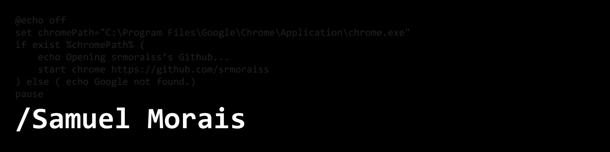

&nbsp;&nbsp;&nbsp;

Me chamo Samuel Morais, sou técnico em informática para internet e atualmente estou cursando Análise e Desenvolvimento de Sistemas. Sou apaixonado por tecnologia e inovação, buscando sempre aprender e aplicar novos conhecimentos em programação, desenvolvimento de software e soluções digitais.
&nbsp;

<picture>
  <source
    srcset="https://github-readme-stats.vercel.app/api?username=smoraiss&show_icons=true&theme=dark"
    media="(prefers-color-scheme: dark)"
  />
  <source
    srcset="https://github-readme-stats.vercel.app/api?username=smoraiss&show_icons=true"
    media="(prefers-color-scheme: light), (prefers-color-scheme: no-preference)"
  />
  
</picture>
 <picture>
  <source
    srcset="https://github-readme-stats.vercel.app/api/top-langs/?username=anuraghazra&hide_progress=false&theme=dark&langs_count=3"
    media="(prefers-color-scheme: dark)"
  />
  <source
    srcset="https://github-readme-stats.vercel.app/api/top-langs/?username=anuraghazra&hide_progress=false&theme=dark&langs_count=3"
    media="(prefers-color-scheme: light), (prefers-color-scheme: no-preference)"
  />
  
</picture>
 

 
 &nbsp;
 &nbsp;

## Minhas Habilidades:

 

&nbsp;
&nbsp;

## Contato:

 

 

&nbsp;&nbsp;
 

  
  

